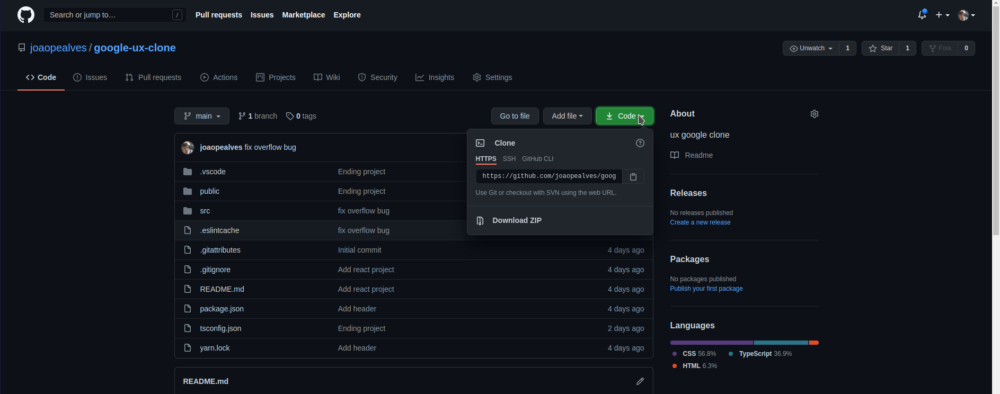
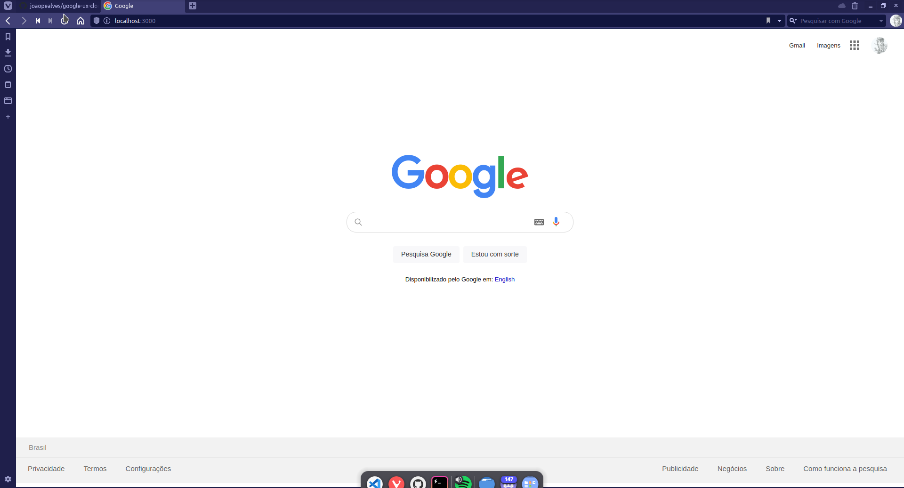

# Google 💻

## Deploy

Site Demo: https://joaopealves.github.io/google-ux-clone/

Video Demo: https://www.youtube.com/embed/lpMYAszUsGg

## Sobre o projeto

Um projeto criado em React, usando o create React App. Um clone da landing page da google e com um switch para poder alterar entre dark-mode e light-mode.
 

<h1> Como instalar o Projeto 💻</h1>
<h2>Download do Projeto</h2>
    
      
    
Faça o clone do Repositorio em sua maquina com o comando <code>git clone https://github.com/joaopealves/google-ux-clone.git</code>

  

<h2><strong>Adicione-me ao seu git</strong> </h2>🚀

É necessário instalar a node_modules ! 

Use <code>npm init -y</code> caso esteja usando o npm, se optar por utilizar o yarn utilize o comando <code>yarn.</code>

após a instalação do node_modules basta digitar pelo terminal:

    cd google-ux-clone -> yarn start

# -Features

    Arrumar a responsividade

# LinkedIn

<h3>João Pedro  <h3>

# Tecnologias usadas

<ul>
    <li>&nbsp;&nbsp;&nbsp;HTML 5</li>
    <li>&nbsp;&nbsp;&nbsp; CSS 3 </li>
    <li>&nbsp;&nbsp;&nbsp;TypeScript</li>
    <li>&nbsp;&nbsp;&nbsp;JavaScript</li>
    <li>&nbsp;&nbsp;React.js</li>

</ul>
